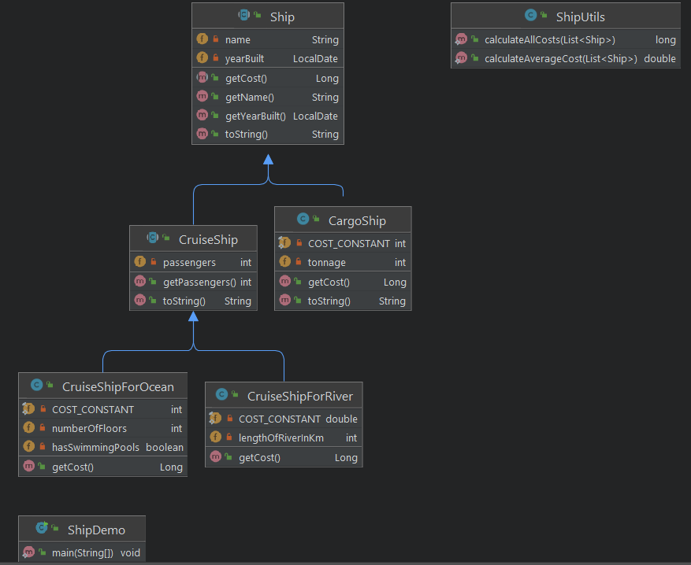
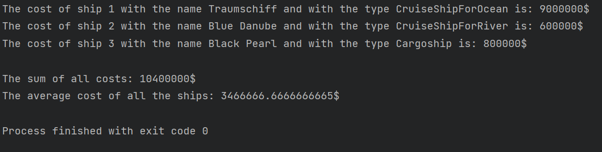

# Ship exercise 

Try to translate the following UML diagram into code:

Design two abstract classes: `Ship` and `CruiseShip`.
Those two classes should contain the abstract method `getCost()` which returns the cost for every concrete Ship.
In calculating the costs for each ship try to integrate the individual fields of the concrete types.
Here are some ideas:
- getCost() for CargoShip = tonnage * CostConstant (which e.g. has the value 20)
- getCost() for CruiseShipOcean = numberOfFloors * CostConstant (which e.g. has the value 3000 if hasSwimmingPools is true, otherwise it is 2500)
- getCost() for CruiseShipRiver = lengthOfRiverInKm * CostConstant (which e.g. has the value 3)

Of course, you can use other formulas 😊
For the specific fields and their types please refer to the UML class diagram.

### `ShipUtils.java`
The ShipUtils Class should contain two static methods with the following signature:
- `public static long calculateAllCosts(List<Ship> ship)`
- `public static double calculateAverageCost(List<Ship> ship)`

### `ShipDemo.java`
In the ShipDemo class create a main method and do the following: 
Demonstrate the classes in a List of Ships. Assign all the concrete Ship types to the array elements. The program should then step through the list, calling each getCost() method. (polymorphism)
For iterating over all the Ships, try the use 3 different ways:
- for loop
- foreach loop
- Iterator

Now print all the individual costs of each Ship, the sum of it and the average as it is in screenshot.

Please follow also other guidelines:
- for each concrete class try to have at least 3 different constructors
  - also use the `this()` constructor
- implement in every class the `toString()` method
- use the keyword `final` where it is applicable

